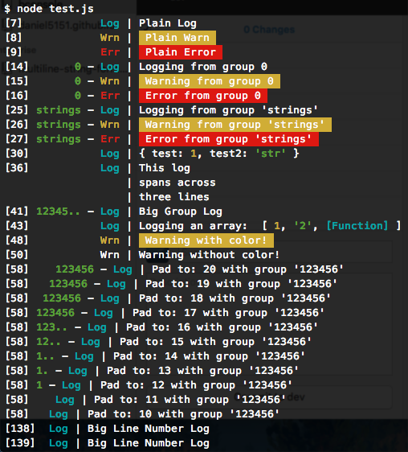

# bconsole - A better console for node.js
bconsole extends node.js's built in `console` with several additions:

- Line number
- Colorized! (togglable)
	- Warnings and Errors 
    - Object logging (using util.inspect())
- Groups
	- Toggle groups of logs/errors/warnings on or off dynamically
	- Truncate long group names when not enough room in prefix
- Keeps start of all messages aligned on the same column
- Options customizeable on the fly!


# Installation
Run 
```
npm install bconsole
``` 
and then add 
```js
var bconsole = require('bconsole')({/* options */})
```
to your project.

# Example
The following output:



Is a result of the following code:
```js
1   | // instantiate with custom options
2   | var bconsole = require("bconsole")({
3   |     pad_to: 18
4   | });
5   | 
6   | // Classic log/warn/error
7   | bconsole.log("Plain Log");
8   | bconsole.warn("Plain Warn");
9   | bconsole.error("Plain Error");
10  | 
11  | // Supports groups
12  | bconsole.toggleGroup(0);
13  | 
14  | bconsole.glog(0, "Logging from group 0");
15  | bconsole.gwarn(0, "Warning from group 0");
16  | bconsole.gerror(0, "Error from group 0");
17  | 
18  | bconsole.toggleGroup(0);
19  | 
20  | bconsole.glog(0, "Won't print");
21  | 
22  | // Groups can be strings too
23  | bconsole.toggleGroup("strings");
24  | 
25  | bconsole.glog('string', "Logging from group 'string'");
26  | bconsole.gwarn('string', "Warning from group 'string'");
27  | bconsole.gerror('string', "Error from group 'string'");
28  | 
29  | // Logs objects using util.inspect()
30  | bconsole.log({
31  |     test: 1,
32  |     test2: "str"
33  | });
34  | 
35  | // Supports multiline logs!
36  | bconsole.log("This log\nspans across\nthree lines")
37  | 
38  | // Groups with long names are truncated if there is not
39  | // enough room in the prefix
40  | bconsole.toggleGroup("123456789");
41  | bconsole.glog("123456789", "Big Group Log");
42  | 
43  | bconsole.log("Logging an array: ", [1, "2", function() {
44  |     return "3";
45  | }]);
46  | 
47  | // Toggle color on or off
48  | bconsole.warn("Warning with color!");
49  | bconsole.setOption("color", false);
50  | bconsole.warn("Warning without color!");
51  | 
52  | bconsole.setOption("color", true);
53  | 
54  | // Change options on the fly!
55  | bconsole.toggleGroup(123456);
56  | for (var i = 20; i >= 10; i--) {
57  |     bconsole.setOption("pad_to", i);
58  |     bconsole.glog(123456, "Pad to: " + i + " with group '123456'");
59  | }

...

138 | bconsole.log("Big Line Number Log")
139 | bconsole.glog("strings", "Big Line Number Log")

```

# Methods
```js
/* --------------- *
 * Logging Methods *
 * --------------- */

// Unconditional logging, will always fire
bconsole.log(..args)					
bconsole.warn(..args)					
bconsole.error(..args)					

// Group based logging, will only fire if associated group is enabled
bconsole.glog("group_name", ..args)	
bconsole.gwarn("group_name", ..args)	
bconsole.gerror("group_name", ..args)	

/* -------------- *
 * Option Methods *
 * -------------- */
 
bconsole.toggleGroup("group_name", true|false)	// Set group "group_name" to true / false
												// If no state is given, will flip state of group
bconsole.setOption("option_name", setting) 		// Change option to desired setting

```

# Default Options
To override these options, when instantiating bconsole, pass is an object with any modified properties. To change properties after instantiation, use `bconsole.setOption`.
```js
{
	pad_to: 16, 			/* int  */ // The number of chars before " | "
    color: true, 			/* bool */ // Enable ANSI Color codes in output
    groups: { 				/* obj  */ // Enable / Disable multiple groups at instantiation
    	"testgroup": true,	/* bool */
    	...
	}
}
```
*NOTE*: `groups` is a special option that can *only be passed in at instantiation!* To change enabled groups after the fact, use `bconsole.toggleGroup()`